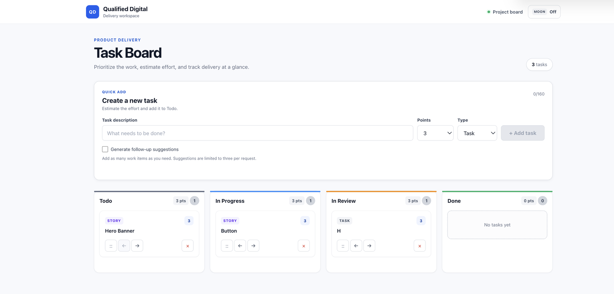

# Sample Trello Task Board

**Candidate:** Nithin Artham

A production-minded Trello-style workflow board built with React 17, TypeScript,
SCSS, Netlify Functions, and optional OpenAI-compatible suggestions.

## Application preview



## Features

- Todo, In Progress, In Review, and Done workflow columns
- Task creation, deletion, and boundary-aware movement controls
- Mouse, touch, and pen drag-and-drop through dedicated card handles
- Task, Story, and Bug classifications
- Fibonacci effort points with per-column totals
- Versioned browser persistence across refreshes
- Persistent light and dark themes with system-preference initialization
- Responsive mobile, tablet, and desktop layouts
- Accessible labels, focus management, live announcements, and reduced motion
- Optional provider-backed suggestions with a labeled offline demo fallback
- Automated coverage for board, API-client, and serverless-function behavior

## Quick start

Requirements:

- Node.js 18 or newer
- npm

```bash
npm install
npm run dev
```

Open `http://localhost:8888`. Netlify Dev serves the React application and local
serverless function through the same origin.

| Command | Purpose |
| --- | --- |
| `npm run dev` | Start React and Netlify Functions |
| `npm start` | Start React without the function proxy |
| `npm test -- --watchAll=false` | Run the test suite once |
| `npm test -- --watchAll=false --coverage` | Run tests with coverage |
| `npm run test:e2e` | Run the Playwright browser tests |
| `npm run build` | Create the production bundle |

Install the Chromium test browser once before the first end-to-end run:

```bash
npx playwright install chromium
```

## Optional AI provider

The board remains fully functional without provider credentials. In that mode,
the function returns deterministic suggestions labeled **Offline demo**.

Provider-backed suggestions require an ignored `.env` file:

```env
OPENAI_API_KEY=provider-api-key
AI_MODEL=provider-model-name
```

OpenAI project scoping and another OpenAI-compatible endpoint are optional:

```env
OPENAI_PROJECT_ID=openai-project-id
AI_BASE_URL=https://provider.example/v1
```

Provider credentials remain server-side and must not be committed or included in
submission archives.

## Architecture

```text
App
└── TaskBoardComponent
    ├── NewTaskForm
    └── DndContext
        ├── Column: Todo
        │   └── TaskCard[]
        ├── Column: In Progress
        │   └── TaskCard[]
        ├── Column: In Review
        │   └── TaskCard[]
        └── Column: Done
            └── TaskCard[]
```

- `src/components/ChallengeComponent.tsx` owns task state, persistence, workflow
  transitions, drag completion, focus restoration, and status announcements.
- `src/components/NewTaskForm.tsx` handles validated task creation and optional
  suggestions.
- `src/components/Column.tsx` renders workflow metrics and droppable regions.
- `src/components/TaskCard.tsx` renders work-item details and movement controls.
- `src/ai.ts` validates communication with the suggestion endpoint.
- `src/netlify/functions/suggest.ts` validates requests and accesses the
  configured provider without exposing credentials to the browser.

## Data model

Each work item contains:

```ts
interface Task {
  id: number;
  text: string;
  points: number;
  type: WorkItemType;
  state: TaskState;
}
```

Tasks persist under the versioned local-storage key `qd-task-board:v1`. Restored
data is validated before entering application state. Invalid or unavailable
storage falls back to an empty in-memory board.

## Accessibility and responsive behavior

- Arrow controls provide a keyboard and screen-reader alternative to dragging.
- Touch dragging uses a dedicated handle with delayed activation to reduce
  accidental movement while scrolling.
- Icon controls have task-specific accessible names.
- Focus follows a card after button-based movement.
- Live regions announce movement and deletion.
- The layout displays one, two, or four columns according to viewport width.
- The theme toggle exposes its current state and supports keyboard operation.

## Testing

The Jest and React Testing Library suites cover:

- Column rendering
- Task creation, trimming, types, and points
- Workflow movement and boundaries
- Deletion and focus restoration
- Touch-capable drag-handle configuration
- Browser persistence
- API-client success, failure, and malformed responses
- Netlify method, JSON, and input validation
- Offline demo suggestions

The Playwright suite runs against the complete Netlify development application
in Chromium and verifies:

- Task creation and movement through the workflow
- Browser persistence after a page refresh
- Pointer-based drag-and-drop between columns
- Dark-mode persistence after a page refresh

## Documentation

- `AGENTS.md` defines implementation and validation expectations.
- `DOCUMENTATION.md` records AI-tool usage, architecture decisions, security,
  accessibility, and tradeoffs.
- `INSTRUCTIONS.md` and `SETUP_GUIDE.md` preserve the original project reference
  material.

## Tradeoffs and future work

Browser storage provides lightweight single-device persistence without adding a
database or authentication. A multi-user production version would require
authenticated backend storage, synchronization, rate limiting, and abuse
monitoring for provider-backed suggestions.
